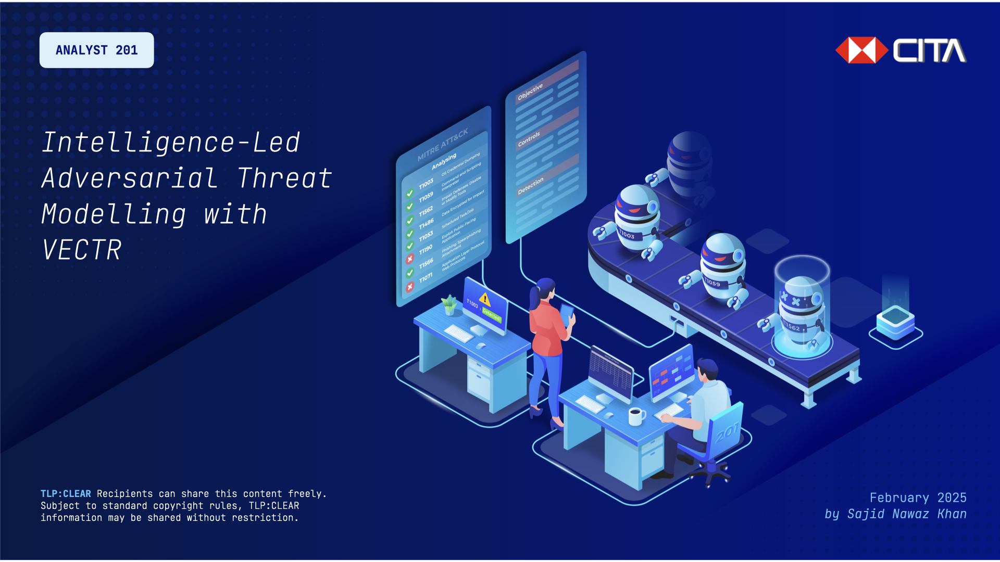

# Intelligence-Led Adversarial Threat Modelling with VECTR

More and more organisations are beginning to realise the value of ATT&CK. But how can you bring your teams together to help nurture, develop and deploy a framework which consistently yields results?

This presentation details the approach developed by the Cyber Threat Intelligence team of a global bank, and how it worked together with defensive and offensive teams to deliver a compelling solution to uplift the organisations' security posture; one adversary TTP at a time.

The corresponding workshop is designed to provide practical guidance to practitioners that they can adapt for their organisations. Key learning objectives will include transforming countermeasure initiatives to be intelligence-led, and developing and deploying a threat library.


[](./Adversarial-Threat-Modelling_Presentation.pdf)


by Sajid Nawaz Khan, _Principal Cyber Threat Intelligence Analyst_

___

**UPDATED**: This README is designed to support the above workshop, originally titled _Adversarial Threat Modelling — A Practical Approach to Purple Teaming in the Enterprise_, which took place on Friday 11th September 2020 as part of [x33fcon](https://www.x33fcon.com/), and which was significantly refreshed and revised in September 2024.


## System Requirements
Please ensure you have installed [VirtualBox](https://www.virtualbox.org) (or your preferred hypervisor) with its corresponding [Extension Pack](https://www.virtualbox.org/wiki/Downloads), followed by [Ubuntu 22.04 LTS](https://wiki.ubuntu.com/Releases). Ideally, the virtual machine should be configured with _at least_ 8GB of RAM, and 80GB of disk space. _Note that this workshop is not compatible with Apple Silicon processors_.


## Installing VECTR
Detailed installation instructions are available on the [VECTR Documentation](https://docs.vectr.io) site. The code below is provided for convenience, and is correct for version 9.5.3 of the Community Edition.


### Installing Dependencies
```

sudo apt-get update
sudo apt-get install ca-certificates curl git wget


# Add Docker’s official GPG key
sudo install -m 0755 -d /etc/apt/keyrings
sudo curl -fsSL https://download.docker.com/linux/ubuntu/gpg -o /etc/apt/keyrings/docker.asc
sudo chmod a+r /etc/apt/keyrings/docker.asc


echo \
  "deb [arch=$(dpkg --print-architecture) signed-by=/etc/apt/keyrings/docker.asc] https://download.docker.com/linux/ubuntu \
  $(. /etc/os-release && echo "$VERSION_CODENAME") stable" | \
  sudo tee /etc/apt/sources.list.d/docker.list > /dev/null


# Install Docker
sudo apt-get update
sudo apt-get install docker-ce docker-ce-cli containerd.io docker-buildx-plugin docker-compose-plugin

```


### Installing VECTR
To minimise issues during the workshop, please continue with default configuration options when installing VECTR. In production environments, configuring additional options within the `.env` file is strongly recommended.

```

sudo mkdir -p /opt/vectr
cd /opt/vectr

sudo wget https://github.com/SecurityRiskAdvisors/VECTR/releases/download/ce-9.5.3/sra-vectr-runtime-9.5.3-ce.zip 
sudo unzip sra-vectr-runtime-9.5.3-ce.zip

```

### Updating the Hosts File
For a default install, add `sravectr.internal` to your hosts file as follows:

```

sudo nano /etc/hosts
127.0.0.1   localhost   sravectr.internal

```


## Using VECTR
### Launching VECTR
Run a docker compose command to bring up the containers. This will take a few minutes as Docker will need to download the images and then build the containers. 

```

cd /opt/vectr
sudo docker compose up -d

```

Struggling to launch VECTR? Run `sudo docker ps`, `sudo docker stop {containerID}` (or `sudo docker stop $(docker ps -a -q)`) and `sudo docker system prune` and try again.


### Logging into VECTR
You should be able to access VECTR at https://sravectr.internal:8081/. The default username is `admin` and the password is `11_ThisIsTheFirstPassword_11`.


### Safely Shutting Down VECTR
```

cd /opt/vectr
sudo docker-compose down

```


### Add Bash Aliases (Optional)
```

nano ~/.bashrc

# Add these entries
alias startvectr="cd /opt/vectr && sudo docker compose up -d"
alias stopvectr="cd /opt/vectr && sudo docker compose down"

```

___


## Exercises
### Importing Existing Datasets
_Not recommended for production deployments!_
1. [Atomic Red Team](https://github.com/redcanaryco/atomic-red-team/blob/master/atomics/Indexes/index.yaml)
2. [MITRE Enterprise ATT&CK CTI Bundle](https://github.com/mitre/cti/blob/master/enterprise-attack/enterprise-attack.json)
3. [SRA Iran TTPs](https://github.com/SecurityRiskAdvisors/VECTR/blob/master/cti/Iranian_TTP_Bundle_010920.json)


### Developing your Threat Library
> Creating your own adversary emulation plan draws on the greatest strength of combining red teaming with your own threat intelligence: the behaviors are seen from real-world adversaries targeting you! — _Mitre_


1. [Malpedia](https://malpedia.caad.fkie.fraunhofer.de)
2. [MITRE Engenuity Adversary Emulation Library](https://mitre-engenuity.org/cybersecurity/center-for-threat-informed-defense/adversary-emulation-library/)
3. [APT & Cybercriminals Campaign Collection](https://github.com/CyberMonitor/APT_CyberCriminal_Campagin_Collections)
4. [Palo Alto Networks Unit 42 Playbooks](https://pan-unit42.github.io/playbook_viewer/)


### Generating Insights Using `ipysigma`/Gephi
> Gephi and other link analysis tools can be used to surface trends within a VECTR dataset, allowing defenders to focus their efforts on prevalent techniques observed across a range of threat groups. 

1. Export your VECTR database via _Environment ▶ Export Active Environment_, and save it as `VECTR.csv`
2. Create a Python venv, and install dependencies via `pip install ipysigma networkx pandas`
3. Optionally, update `threat_actor_include`, `threat_actor_exclude` and `year`, and uncomment `# vectr_df = vectr_filtered_df`
4. Run `VECTR_Gephi_Directed.ipynb`, and view `VECTR_Directed.html`

___


## Further Reading
> Cyber threat intelligence is all about knowing what your adversaries do and using that information to improve decision-making. — _MITRE_

1. [Getting Started with ATT&CK: Threat Intelligence](https://medium.com/mitre-attack/getting-started-with-attack-cti-4eb205be4b2f)
2. [Getting Started with ATT&CK: Adversary Emulation and Red Teaming](https://medium.com/mitre-attack/getting-started-with-attack-red-29f074ccf7e3)
3. [Thai CERT Threat Actor Encyclopedia](https://www.thaicert.or.th/downloads/files/A_Threat_Actor_Encyclopedia.pdf)
4. [Recorded Future Threat Intelligence Handbook](https://go.recordedfuture.com/book)
5. [Adversary Emulation using CALDERA](https://www.slideshare.net/erikvanbuggenhout/adversary-emulation-using-caldera) by Erik Van Buggenhout
6. [Assess Your Data Potential with ATT&CK Datamap](https://medium.com/@olafhartong/assess-your-data-potential-with-att-ck-datamap-f44884cfed11) by Olaf Hartong
7. [Purple Team Exercise Framework](https://www.scythe.io/ptef) by SCYTHE
8. [Threat Modeling: As Easy as OATMEAL](https://www.elastic.co/blog/threat-modeling-oatmeal) by Elastic


### Tools
1. [MITRE ATT&CK Navigator](https://mitre-attack.github.io/attack-navigator/enterprise/)
2. [ATT&CK Powered Suit](https://mitre-engenuity.org/cybersecurity/center-for-threat-informed-defense/attack-powered-suit/) -- Browser extension / ATT&CK reference 
3. [Threat Report ATT&CK Mapping (TRAM)](https://github.com/center-for-threat-informed-defense/tram/) -- For rapid triage
4. [Sigma](https://github.com/Neo23x0/sigma)


### Support
1. [VECTR Documentation](https://docs.vectr.io)
2. [VECTR Video Guides](https://docs.vectr.io/How-To-Videos/)
3. [VECTR Issues on Github](https://github.com/SecurityRiskAdvisors/VECTR/issues)
4. [SRA VECTR Homepage](https://sra.io/vectr/)

---

I'd love to hear your thoughts and feedback. Feel free to say hello at [@snkhan@infosec.exchange](https://infosec.exchange/@snkhan) or via [LinkedIn](https://uk.linkedin.com/in/sajidnawazkhan).

---

#cti #threatintelligence #purpleteam #redteam #blueteam #adversaryemulation #adversarysimulation #vectr #mitre
